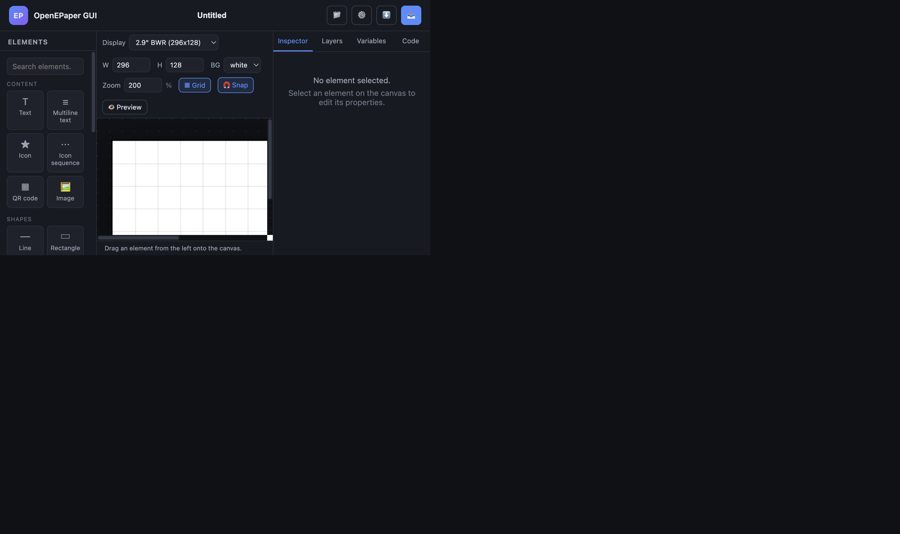

# OpenEPaper GUI

A self-hosted, browser-based **drag & drop editor** that generates
[`drawcustom`](https://github.com/OpenEPaperLink/Home_Assistant_Integration/blob/main/docs/drawcustom/supported_types.md)
payloads for the [OpenEPaperLink](https://github.com/OpenEPaperLink/Home_Assistant_Integration)
Home Assistant integration — a visual builder for e-paper displays, similar in
spirit to Elementor.

You design a layout on a pixel-accurate canvas, and the app emits the Jinja
template that Home Assistant expects. No YAML or Jinja is written by hand.



```jinja


[
  {
    "type": "text",
    "value": " ",
    "x": 0,
    "y": 0,
    "size": 1,
    "color": "yellow"
  }
  
    ,{
      "type": "text",
      "value": "{{ times[i] }}",
      "x": {{ 15 + i*spacing }},
      "y": 5,
      "size": 10
    }
    ,{
      "type": "icon",
      "value": "{{ icon_map.get(forecast[i].condition,'mdi:emoticon-happy') }}",
      "x": {{ 5 + i*spacing }},
      "y": 10,
      "size": 50
    }
  
]
```

---

## Quick start

```bash
git clone <this-repo> openepaper-gui
cd openepaper-gui

cp .env.example .env
# edit .env: set HA_URL and HA_TOKEN

docker compose up -d --build
```

Open **http://localhost:8099** (or whatever `APP_PORT` you set).

```bash
docker compose logs -f        # follow logs
docker compose down           # stop
docker compose down -v        # stop and wipe saved projects
```

### Development (hot reload)

```bash
docker compose -f docker-compose.yml -f docker-compose.dev.yml up
```

The `backend/app` and `frontend` folders are bind-mounted, and uvicorn runs with
`--reload`.

---

## Configuration

Everything can be configured in the UI under **⚙️ Settings**, or via environment
variables in `.env`:

| Variable | Default | Description |
| --- | --- | --- |
| `APP_PORT` | `8099` | Host port the editor is served on |
| `HA_URL` | `http://homeassistant.local:8123` | Home Assistant base URL |
| `HA_TOKEN` | – | Long-lived access token |
| `LOG_LEVEL` | `info` | uvicorn log level |
| `DATA_DIR` | `/data` | Where projects and settings are stored |
| `CORS_ORIGINS` | – | Extra browser origins allowed to call the API, comma separated |
| `ALLOWED_HOSTS` | – | Extra hostnames the editor answers to, e.g. `epaper.example.com`, `*.example.com`; `*` disables the check |
| `ALLOWED_SERVICE_DOMAINS` | `open_epaper_link` | Home Assistant service domains *Send to display* may call |

Create a token in Home Assistant under **Profile → Security → Long-lived access
tokens**. Values saved in the UI take precedence over environment variables.
The token is bound to the URL it belongs to: `HA_TOKEN` is only sent to
`HA_URL`, and changing the URL in the UI discards the saved token, so enter the
token again together with a new URL.

---

## Using the editor

### Canvas

| Action | How |
| --- | --- |
| Add element | Drag from the left palette onto the canvas, or double-click it |
| Select | Click the element |
| Move | Drag it, or use the arrow keys (`Shift` = 10 px steps) |
| Resize | Drag the corner / edge handles |
| Duplicate | `Ctrl`/`Cmd` + `D` |
| Delete | `Delete` / `Backspace` |
| Centre horizontally | `C` (without modifiers) |
| Save now | `Ctrl`/`Cmd` + `S` |
| Deselect | `Esc` |

Toggle **Grid** and **Snap** in the toolbar. **Preview** hides the selection
chrome so you see the design as it will render.

### Display resolution

Pick a preset (2.9", 2.13", 4.2", 7.5" …) or enter a custom width/height. The
canvas resizes immediately and coordinates are in display pixels, so the
generated payload matches the target panel. Position fields also accept
percentages of the canvas (`50%`), as `drawcustom` does; together with an
`anchor` such as `mm` this centres an element.

### Element types

All types from the `drawcustom` documentation are supported:

| Category | Types |
| --- | --- |
| Content | `text`, `multiline`, `icon`, `icon_sequence`, `qrcode`, `dlimg` |
| Shapes | `line`, `rectangle`, `rectangle_pattern`, `polygon`, `circle`, `ellipse`, `arc` |
| Data | `progress_bar`, `plot` |
| Utility | `debug_grid` |

Every documented property is exposed in the Inspector, grouped into
**Content / Position / Style / Advanced** — including the plot's
`ylegend` / `yaxis` / `xlegend` / `xaxis` options under **Axes & legends**
(tick a box to switch one on).

Where the OpenEPaperLink image generator derives a default from other
properties, the editor follows it: `multiline` anchors every line at `lm`
(left-middle), a multi-line or wrapped `text` gets an explicit `anchor`, and a
rectangle with `corners` always carries its `radius` (HA would otherwise round
with 10 px).

### Home Assistant templates

Any text or number field accepts Jinja. Type `{{ states('sensor.temp') }}` into
a value and Home Assistant evaluates it at render time: in number fields the
expression is emitted bare (`"x": {{ 15 + i*spacing }}`), in text fields it
stays inside the JSON string (`"value": "{{ states('sensor.temp') }} °C"`). A
bare expression typed into a number field, such as `15 + i*spacing`, is wrapped
in `{{ }}` for you. Fields containing `{{` or `{%` are tagged with a **jinja**
badge.

### Variables

The **Variables** tab emits project-level `` statements:

```
spacing  = 49
temp     = states('sensor.living_room_temperature')
```

Then reference them anywhere, e.g. `{{ 15 + i*spacing }}`.

### Repeat groups (loops)

A **Repeat group** wraps its children in a `` loop — this is how the
8-column forecast example is built.

1. Add a **Repeat group** from the palette (under *Structure*).
2. Drag the elements that should repeat onto the canvas.
3. Select the group and set the **loop variable** (`i`), **iterations** (`8`,
   or a Jinja expression such as `forecast | length`) and any **pre-loop
   statements** (e.g. `offsets = [offset_0, offset_1, ...]`).
4. Use `i` in child fields: `{{ 15 + i*spacing }}`.

Groups can be nested (drag a group onto another one in the **Layers** tab) to
build nested loops, e.g. rows × columns; give each level its own loop variable.
An **Enabled** checkbox turned off makes a group a plain folder that emits its
children once.

The generator handles comma placement so the output is always valid JSON: a
group that is the first element emits `,`
instead of a leading comma, and a dynamic iteration count or nested groups
switch to a runtime flag (`oepl_ns`). Anything the generator has to skip, or a
nested group reusing its parent's loop variable, is listed as a warning above
the output in the **Code** tab.

### Exporting

The **Code** tab shows the live output as **Jinja**, **YAML** or **JSON**.
**⬇️ Export** downloads the template as a `.jinja` file. **Copy template**
puts it on the clipboard for pasting into a script, automation or template
sensor.

**✓ Validate** renders the template and checks the result, showing a green or
red badge:

* **green** — the template rendered and produced a valid array of elements, with
  the element count and where the render happened;
* **red** — with the stage that failed (*render*, *parse* or *elements*), the
  error message, an excerpt with a caret under the offending character, and a
  per-element list of problems such as `Element 2 (type 'line'): missing
  required key 'x_end'`.

Validation uses Home Assistant when it is reachable, so the check reflects live
entity state. Otherwise it falls back to a local Jinja sandbox with permissive
stubs: unresolved values render as `0`, which is enough to prove the template
renders and that the payload is well formed. This also catches the one thing
that cannot be checked statically — a quote that only appears at render time
inside a `{{ }}` expression, which produces invalid JSON.

### Sending to a display

**📤 Send to display** renders the template and calls the configured Home
Assistant service (default `open_epaper_link.drawcustom`):

```yaml
service: open_epaper_link.drawcustom
data:
  device_id: "0011223344556677"
  payload:
    - type: text
      value: "21.5 °C"
      x: 40
      y: 46
      size: 22
  background: white
  rotate: 0
  dither: 2
  ttl: 60
```

The template is rendered through Home Assistant first (`POST /api/template`)
and the resulting **list** is sent as `payload`. This matters: the integration
reads `payload` as a finished list of elements and never renders Jinja itself,
and `/api/services` does not render templates inside `data` either — so sending
the raw template would reach the tag unrendered and fail. If the template does
not render to a valid payload, nothing is sent and the error is reported.

**Rotate**, **Dither** (0 none, 1 Floyd-Steinberg, 2 ordered) and **TTL** are
set in the *Send to display* dialog and saved with the project. Enable
**Dry run** to have Home Assistant render the image without pushing it to the
tag.

---

## Architecture

```
.
├── docker-compose.yml          # production stack
├── docker-compose.dev.yml      # dev override (bind mounts + reload)
├── .env.example
├── backend/
│   ├── Dockerfile
│   ├── requirements.txt
│   └── app/
│       ├── main.py             # FastAPI app + static hosting
│       ├── schema.py           # single source of truth for element types
│       ├── generator.py        # visual model -> Jinja / YAML / JSON
│       ├── templating.py       # render + validate the generated template
│       ├── storage.py          # JSON-file project storage
│       ├── ha_client.py        # Home Assistant REST client
│       ├── test_generator.py   # generator tests
│       ├── test_templating.py  # render / validation tests
│       └── test_api.py         # HTTP / security tests
└── frontend/
    ├── index.html
    ├── css/styles.css
    └── js/
        ├── app.js              # entry point, wiring
        ├── api.js              # REST client
        ├── state.js            # state store + node helpers
        ├── canvas.js           # drag & drop, move, resize
        ├── geometry.js         # bounding boxes per element type
        ├── renderer.js         # on-canvas previews
        ├── inspector.js        # schema-driven property editor
        ├── layers.js           # layer tree
        ├── variables.js        #  editor
        ├── code.js             # generated output panel
        ├── presets.js          # starter templates
        └── modals.js           # projects / settings / export / push
```

The backend serves the static frontend, so the whole app is a single container
on a single port.

`schema.py` drives three things at once: the Inspector UI, the canvas geometry
and the generator. Adding a new draw type means adding one entry there.

### Generation rules

* Required properties are always emitted.
* Optional properties are emitted only when they differ from the documented
  default — so the output stays as short as a hand-written template. Properties
  whose Home Assistant default is dynamic (a line's `y_end`, a plot's box,
  `multiline.y`, …) are always emitted, so the display matches the canvas.
* Jinja in number fields is emitted bare, in text fields inside the string.
* Properties whose documented default is `null` are omitted unless explicitly
  set.

---

## Tests

```bash
cd backend
pip install -r requirements-dev.txt
python -m pytest -q app
ruff check app
```

`test_generator` renders generated templates with a real Jinja environment and
asserts the result is valid JSON — covering the weather example, repeat-group
comma placement, hidden elements, quoting, percentages and dynamic defaults.
`test_templating` covers the render sandbox (permissive stubs, sandbox escapes,
error reporting) and each validation stage, including the caret position in the
error excerpt. `test_api` covers the HTTP layer: path traversal, host check,
project ids, token handling and that *Send to display* renders before sending.

---

## API reference

| Method | Path | Description |
| --- | --- | --- |
| `GET` | `/api/health` | Health check |
| `GET` | `/api/schema` | Element type schema |
| `GET` | `/api/projects` | List saved projects |
| `GET` | `/api/projects/{id}` | Load a project |
| `POST` | `/api/projects` | Create a project |
| `PUT` | `/api/projects/{id}` | Update a project |
| `DELETE` | `/api/projects/{id}` | Delete a project |
| `POST` | `/api/generate/template` | Generate Jinja / YAML / JSON |
| `POST` | `/api/validate` | Render the template and check the payload |
| `GET` | `/api/settings` | Read settings (token redacted) |
| `POST` | `/api/settings` | Save settings |
| `GET` | `/api/ha/status` | Test the Home Assistant connection |
| `GET` | `/api/ha/entities` | List entities (optional `?domain=`) |
| `POST` | `/api/ha/push` | Render and send to a display |

Interactive docs are available at `/docs`.

---

## Notes & limitations

* Projects are stored as JSON files in the `epaper-gui-data` volume. Back it up
  if you care about the layouts.
* The canvas is a **design-time approximation**. Home Assistant and Pillow do
  the real rendering, so exact font metrics and icon glyphs can differ slightly.
  Use **Send to display → Dry run** to check the true result.
* Icons in the editor use the MDI webfont from a CDN. Offline, elements fall
  back to a labelled placeholder — the generated payload is unaffected.
* The QR preview is a placeholder; the real code is generated by Home Assistant.
* *Validation* falls back to a local sandbox when Home Assistant is unreachable.
  Unresolved values render as `0`, so the check proves the template renders and
  the payload is well formed — it does not confirm the values are meaningful.

## Security

The editor has **no authentication**. It can read and write your projects, holds
a Home Assistant long-lived token and can push to your displays, so treat it as
a trusted-network tool: bind it to your LAN or put it behind a reverse proxy
with auth, and do not expose the port to the internet.

Built-in guard rails:

* Cross-origin requests are rejected by default. Only set `CORS_ORIGINS` if you
  serve the frontend from a different host or port, and list exact origins —
  without authentication, any allowed origin can act on your behalf.
* Requests whose `Host` header is not an IP address, `localhost`, a dot-less
  name, a LAN suffix (`.local`, `.lan`, `.home.arpa`, …) or listed in
  `ALLOWED_HOSTS` are rejected. This blocks DNS rebinding; behind a reverse
  proxy with its own domain, add that domain to `ALLOWED_HOSTS`.
* The token is only ever sent to the URL it was configured for (see
  *Configuration*), so pointing the editor at another server does not leak it.
* *Send to display* can only call services in `ALLOWED_SERVICE_DOMAINS`
  (default `open_epaper_link`).
